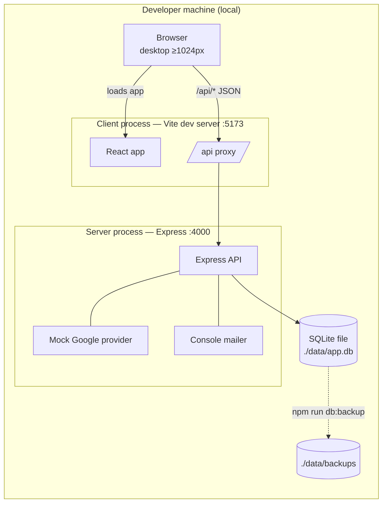
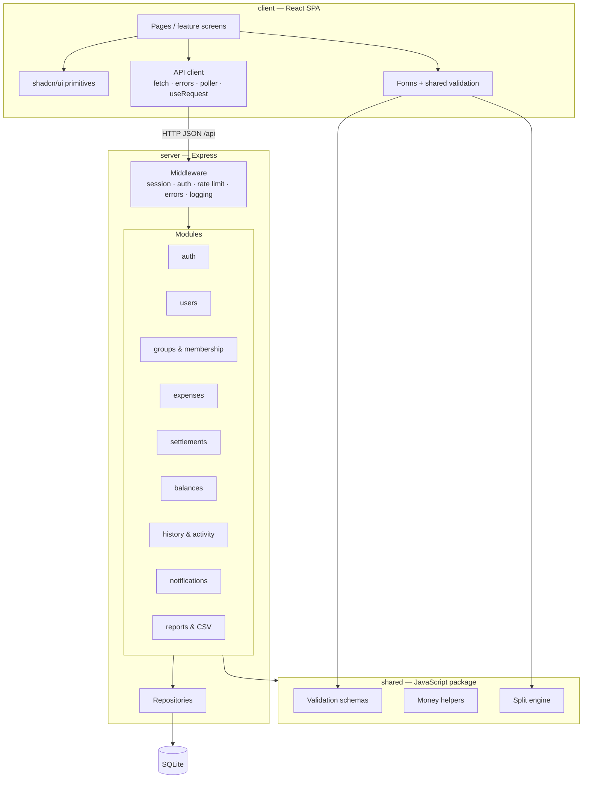

# SplitBook — High-Level Architecture (v1)

Status: **Accepted** (rev 4: email verification removed, v1.3) · 2026-10-01 · Inputs: REQUIREMENTS.md v1.1, DOMAIN_MODEL.md v1.0 · Decisions: ADR.md

Scope: tech stack, system boundaries, components and their responsibilities. API contracts and database schema are the next phase.

---

## 1. Review notes on REQUIREMENTS.md / DOMAIN_MODEL.md

Both documents are consistent with each other. Points that shape the architecture:

| # | Observation | Architectural impact |
|---|---|---|
| R-1 | ~~Email verification needs outgoing email~~ | Removed in v1.3 — no mailer (ADR-006). |
| R-2 | Every change produces history + activity + notifications (FR-EXP-11, FR-ACT-01, FR-NTF-01). | Single transaction per command (ADR-007). |
| R-3 | Balances are derived; guards depend on them (leave, remove, delete account). | Compute on read, one shared balance calculator (ADR-004). |
| R-4 | Live split preview (FR-SPL-06) must match server result. | Shared split engine in browser and server (ADR-010). |
| R-5 | Group deletion removes everything but notifications must survive (FR-NTF-05). | Notifications keep a snapshot of group name/title text, not just a reference. |
| R-6 | Week/month reports in IST, no future dates (FR-RPT-02, FR-EXP-04). | Date handling rule (ADR-011). |
| R-7 | Single-device logout (FR-AUTH-05). | Server-side sessions (ADR-005). |

No requirement conflicts found.

---

## 2. Scale Estimate (10k registered users)

Assumptions are deliberately generous.

| Metric | Assumption | Estimate |
|---|---|---|
| Registered users | given | 10,000 |
| Daily active users | 30% | 3,000 |
| Peak concurrent users | 10% of DAU | ~300 |
| Groups per user | avg 3 | ~6,000 groups (avg 5 members) |
| Expenses | 20 per active user / month | ~60k / month · ~720k / year |
| Expense shares | avg 4 per expense | ~2.9M / year |
| Settlements | ~15% of expenses | ~110k / year |
| Change records + activity events | ~2.5 per change | ~2M / year |
| Notifications | ~3 per expense/settlement | ~2.5M / year |
| **Total rows / year** | | **~8–10M** |
| **DB size / year** | ~300–500 bytes per row incl. indexes | **~3–5 GB** |
| Average request rate | 3k DAU × ~40 requests/day ÷ 86,400 s | ~1.5 req/s |
| Peak request rate | ×10 evening peak + polling | **~15–50 req/s** |
| Peak write rate | | **~1–3 writes/s** |

**Deployment context:** v1 runs locally only (ADR-012). The estimate is the **design target** — it proves the chosen design does not need rework if deployed later.

**Conclusion:** one modest server (2 vCPU, 4 GB RAM, SSD) running one Node process and SQLite in WAL mode handles this with large headroom. Database growth is a few GB per year — no archival needed for v1. Notification retention policy can be added later if needed.

---

## 3. Tech Stack

| Layer | Choice | Why |
|---|---|---|
| Architecture style | **Client–server**: React client ↔ JSON over HTTP ↔ Express server ↔ SQLite | Clear separation; server is the only DB owner |
| Language | **Plain JavaScript (ES modules)** — client, server, shared | Product owner choice; shared rules via Zod (ADR-010) |
| Client framework | **React 19** + **Vite** | Given; fast dev server with `/api` proxy |
| Routing (client) | React Router | Standard SPA routing |
| Network layer (client) | **In-house API client on `fetch`** — no TanStack Query / axios | Owned, predictable (ADR-014) |
| UI primitives | **shadcn/ui** (Radix + Tailwind CSS) | Owned component code (ADR-015) |
| Forms (client) | React Hook Form + Zod resolver | Live validation with shared schemas |
| Server runtime | **Node.js 24 LTS** | Given |
| Web framework | **Express 5** | Given; native async error handling |
| Validation | Zod (shared package) | Same rules client + server |
| Database | **SQLite** (WAL mode), file `./data/app.db` | Given (ADR-002) |
| DB driver | better-sqlite3 | Fast, synchronous, simple transactions |
| Query builder / migrations | Drizzle ORM + drizzle-kit | SQL-like query builder, migrations, PostgreSQL exit path |
| Password hashing | Argon2id | Current best practice |
| Google sign-in | **Mock Google provider** behind identity-provider interface | Local only (ADR-006) |
| Email | None — email verification removed in v1.3 | ADR-006 |
| Security middleware | helmet, express-rate-limit | Headers, brute-force protection |
| Logging | pino (pretty output in dev) | Structured, fast |
| CSV | csv-stringify (streamed) | Correct escaping (FR-RPT-07) |
| Testing | Vitest (unit), Supertest (API), Playwright (end-to-end) | One runner for shared/server/client |
| Repo layout | npm workspaces monorepo: `client`, `server`, `shared` | One repo, shared package |
| Run | `npm run dev` (client + server), `npm run db:reset` (schema + seed), `npm run db:backup` | Local only (ADR-012/013) |

## 4. System Context & Boundaries



### Boundaries

| Boundary | Inside | Outside | Rule |
|---|---|---|---|
| **Client–server boundary** | Server: Express + SQLite | Client: React app in browser | Only JSON over HTTP under `/api/*`. Client holds no business truth; it previews, server decides. |
| **Trust boundary** | Server | Browser | Server re-validates every input and re-checks every permission. |
| **Data boundary** | SQLite file | Everything else | Only the server's repository layer reads/writes the DB. Backup script uses SQLite backup API. |
| **Access boundary** | A user's own groups | Other groups | Every group-scoped request checks membership before returning data (NFR-06). |
| **External-identity boundary** | Identity-provider + mailer interfaces | Google, SMTP (future) | Mocks today; real adapters plug in without service changes (ADR-006). |

## 5. High-Level Design

### 5.1 Container view



### 5.2 Request flow — "Add expense" (typical write)

```mermaid
sequenceDiagram
    participant B as Browser
    participant R as Route
    participant S as ExpenseService
    participant D as Domain (split engine)
    participant DB as SQLite

    B->>B: Live preview with shared split engine
    B->>R: POST add expense
    R->>R: Session → user; validate shape (Zod)
    R->>S: addExpense(user, group, input)
    S->>DB: BEGIN
    S->>DB: Check user active member; payer active member
    S->>D: Calculate shares (paise, remainder rule)
    D-->>S: Shares or validation error
    S->>DB: Insert expense + shares
    S->>DB: Insert change record + activity event
    S->>DB: Insert notifications (payer + participants − actor)
    S->>DB: COMMIT
    S-->>R: Expense
    R-->>B: 201 + expense
    B->>B: Screen refetches group, balances, expense list (ADR-014)
```

### 5.3 Request flow — "View group balances" (typical read)

Route → authorise membership → BalanceService runs aggregate queries over active shares and settlements → nets each pair → returns lines + caller's net. No writes, no cache.

### 5.4 Cross-cutting rules

| Concern | Approach |
|---|---|
| Authentication | Session cookie → session row → user on every request (ADR-005). |
| Authorisation | Service-level checks: active member of group; creator-or-admin for expense edit/delete; party-only for settlements; admin-only for add/remove member and delete group. |
| Validation | Shape at route (Zod), business rules in service. |
| Errors | One error format: code, message, optional field errors. Business-rule failures (e.g. "balance not zero") return 409/422 with details the UI can show. |
| Consistency | One DB transaction per command (ADR-007). |
| Soft delete | Expenses and settlements carry status; all balance/report queries filter active. |
| Departed members | Edit/delete guard checks every involved membership is active (FR-EXP-16, FR-STL-09). |
| Pagination & search | Offset pagination per group; search on description/notes via text match, date, amount. Sufficient at group scale. |
| Logging | Structured request logs with request ID, user ID; no passwords or tokens logged. |
| Security headers | helmet; strict Content-Security-Policy for SPA. |
| Config | Environment variables (Google client ID/secret, SMTP, session secret, DB path). |

---

## 6. Component Responsibilities

### 6.1 Client (React)

| Component | Responsibility | Requirements |
|---|---|---|
| App shell & navigation | Layout, top bar, notification bell with unread count, profile menu, auth-guarded routes | FR-NTF-04, FR-AUTH-06 |
| Auth screens | Sign up, log in (password + Google button), verify-email landing | FR-AUTH-01..04 |
| Profile | Edit name, change password, delete account (shows blocking balances), logout | FR-AUTH-05..08 |
| Dashboard | Totals owed/owing, groups with net, recent activity | FR-DSH-01, FR-BAL-04 |
| Group list & create | Create group, member search by name (verified users) | FR-GRP-01..07 |
| Group detail | Tabs: expenses, balances, settlements, activity, members, settings | FR-GRP-*, FR-ACT-01 |
| Member management | Add, remove, leave; admin-leave dialog (transfer or delete group) | FR-GRP-09..20 |
| Expense form | Payer, participants, split method; live remaining ₹ / %; warnings (settlement exists) | FR-EXP-01..09, FR-SPL-* |
| Expense list & detail | Search, filter, paginate; detail with shares and change history; frozen-state message for departed members | FR-EXP-11..16 |
| Balances view | Pairwise netted lines, drill-down to underlying records | FR-BAL-01..05 |
| Settle-up dialog | Prefilled amount, over-payment warning, edit/delete | FR-STL-* |
| Notifications panel | List, mark read / all read, navigate; disabled link for deleted group | FR-NTF-* |
| Reports | Week/month switch, previous periods, group filter, CSV download | FR-RPT-* |
| API client (network layer) | In-house `fetch` wrapper: base URL, JSON, cookie credentials, timeout/abort, `ApiError` mapping, 401 handling, per-module endpoint functions, `useRequest` hook, visibility-aware poller | ADR-008, ADR-014 |
| UI primitives | shadcn/ui components (button, input, dialog, table, select, tabs, toast, date picker) owned in `components/ui` | ADR-015 |

### 6.2 Shared package

| Component | Responsibility |
|---|---|
| Validation schemas | Input rules: lengths, amount > 0, date not future, split sums |
| Money helpers | Parse/format ₹ ↔ paise, percentage ↔ basis points |
| Split engine | Pure function: amount + method + participants + payer → shares, applying remainder rule; used for UI preview and server truth |
| Error codes | Contracts between client and server |

### 6.3 Server (Express)

| Module | Responsibility | Requirements |
|---|---|---|
| **Middleware** | Request intake; session load; authentication gate; Origin check (CSRF); rate limiting; request ID + logging; central error handler | ADR-005, NFR-08 |
| **auth** | Signup, password login, Google sign-in via identity-provider interface (mock today), account merge, email verification tokens via mailer interface (console today), session create/delete, password change | FR-AUTH-01..07 |
| **dev tools** (non-production only) | Mock Google sign-in returning one hardcoded dummy user; DB seed/reset | ADR-006, ADR-012 |
| **users** | Profile read/update, verified-user search by name, account deletion with zero-balance guard | FR-AUTH-06/08, FR-GRP-04 |
| **groups & membership** | Create (≥2 members), edit details, add/remove/leave, admin-leave (transfer or delete), group delete, membership-based access checks | FR-GRP-01..21 |
| **expenses** | Add/edit/soft-delete; permission (creator or admin); split method lock; departed-member freeze; settlement warning; list/search/paginate; detail | FR-EXP-*, FR-SPL-* |
| **settlements** | Record/edit/soft-delete; party-only permission; over-payment warning; full-amount prefill; departed-member freeze | FR-STL-* |
| **balances** | Pairwise netting per group, member net, overall dashboard totals, drill-down, zero-balance guard used by other modules | FR-BAL-*, DOMAIN §4.2–4.3 |
| **history & activity** | Write change records (before/after) and activity events inside the caller's transaction; read history and feed | FR-EXP-11, FR-ACT-01 |
| **notifications** | Decide recipients, write notifications inside caller's transaction (with text snapshot), unread count, list, mark read | FR-NTF-* |
| **reports** | Per-user paid / share / settlements for IST week or month, all groups or one; streamed CSV with escaping | FR-RPT-* |
| **Repositories** | Only SQL-touching code; one per aggregate (users, sessions, groups, memberships, expenses, settlements, history, notifications) | ADR-009 |
| **DB bootstrap** | Open SQLite with WAL, foreign keys, busy timeout; run migrations at startup | ADR-002 |

### 6.4 Module dependencies (allowed direction)

```
auth ─► users
groups ─► balances (zero-balance guard), history, notifications
expenses ─► groups (membership check), balances (settlement warning), history, notifications, shared/split
settlements ─► groups, balances, history, notifications
reports ─► balances, expenses, settlements (read-only)
balances ─► repositories only
history, notifications ─► repositories only
```
No cycles. `history` and `notifications` are leaf modules called inside other modules' transactions.

### 6.5 Local operations

| Component | Responsibility |
|---|---|
| `npm run dev` | Start client (Vite, with `/api` proxy) and server (Express) together |
| `npm run db:reset` | Run migrations on a fresh DB and load seed data (sample password users, sample groups) |
| `npm run db:backup` | Snapshot DB to `./data/backups`, keep latest 30 |
| Health check | `GET /api/health` — process up, DB readable |

---

## 7. Risks & Mitigations

| Risk | Mitigation |
|---|---|
| Mock Google / console mailer accidentally enabled outside local | Hard-disabled when `NODE_ENV=production`; startup fails if mock enabled in production |
| Own network layer lacks caching/dedup | Explicit refetch after mutations; acceptable at this scale (ADR-014) |
| SQLite write contention if usage grows far beyond estimate | WAL + short transactions; Drizzle keeps PostgreSQL path open (ADR-002) |
| Local data loss | `db:backup` script; seed reset for dev (ADR-013) |
| Polling delay for notifications | Accepted (≤60 s) (ADR-008) |
| Password users locked out (no reset flow) | Accepted risk D-9 |
| NFR-09 (automated daily backups) not met locally | Documented deviation; revisit at deployment |

---

## 8. Resolved Questions

| # | Question | Decision |
|---|---|---|
| Q-1 | Language for network layer / project | Plain `fetch`, plain JavaScript everywhere (ADR-010, ADR-014) |
| Q-2 | Form handling | Keep React Hook Form |
| Q-3 | Mock Google users | One hardcoded dummy user (ADR-006) |

---

## 9. Next Phase

1. Accept / amend ADRs.
2. Database schema (logical → physical) from DOMAIN_MODEL.
3. API contract per module.
4. UI wireframes per screen in §6.1.
