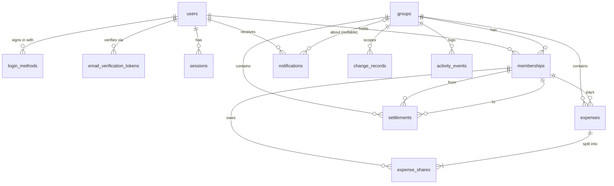

# SplitBook — Database Schema (v1)

Status: **Accepted** (rev v1.3) · 2026-10-01

> **v1.3 change:** email verification was removed. Migration `0002_drop_email_verification.sql` drops `email_verification_tokens` (§4.3). `users.email_verified_at` stays and is set at signup / Google sign-in. Everything below about verification tokens is historical. · Inputs: REQUIREMENTS.md v1.1, DOMAIN_MODEL.md v1.0, ADR.md (accepted)

Engine: SQLite (WAL) via better-sqlite3 + Drizzle (ADR-002). This document is the source of truth for the schema; Drizzle migrations must match it.

---

## 1. Conventions

| Topic | Rule | Source |
|---|---|---|
| Primary keys | `id INTEGER PRIMARY KEY` (SQLite rowid) — except `sessions` (token hash) | |
| Foreign keys | Always declared; `PRAGMA foreign_keys = ON` | |
| Money | `*_paise INTEGER`, always > 0 where entered. ₹123.45 → `12345` | ADR-003 |
| Percentages | `*_bp INTEGER` in basis points with 2 decimals: 33.33% → `3333`, 100% → `10000` | ADR-003 |
| Instants | `TEXT` ISO-8601 UTC with ms, e.g. `2026-10-01T06:36:38.853Z`; sorts correctly as text | ADR-011 |
| Calendar dates | `TEXT` `YYYY-MM-DD` (IST date as entered) | ADR-011 |
| Booleans / enums | `TEXT` with `CHECK (col IN (...))` — readable in plain JS, no magic numbers | |
| Text limits | Enforced by `CHECK (length(col) BETWEEN …)` **and** Zod (ADR-010) | |
| Soft delete | `status` + `deleted_at` + `deleted_by_membership_id` on expenses and settlements | FR-EXP-10, FR-STL-05 |
| Hard delete | Groups only (cascades to all group data) | FR-GRP-13/18 |
| Table mode | `STRICT` tables (SQLite ≥ 3.37) so wrong types are rejected — important with plain JS | ADR-010 |
| Naming | `snake_case`, plural table names, `<thing>_id` for FKs | |
| Who did it | Group-scoped actions reference **membership** (not user) — keeps "(left)" and re-join semantics | DOMAIN §2.5 |

**Connection pragmas (on open):**
```sql
PRAGMA journal_mode = WAL;
PRAGMA foreign_keys = ON;
PRAGMA busy_timeout = 5000;
PRAGMA synchronous = NORMAL;
```

---

## 2. Entity → Table Map

| Domain entity | Table | Notes |
|---|---|---|
| User | `users` | Tombstoned on account deletion, never hard-deleted |
| Login Method | `login_methods` | `password` or `google` |
| (verification) | `email_verification_tokens` | Also holds pending password for merge (DF-3) |
| Session | `sessions` | One row per logged-in device |
| Group | `groups` | Hard delete cascades |
| Membership | `memberships` | One row per stint; re-join = new row |
| Expense | `expenses` | Soft delete |
| Expense Share | `expense_shares` | Replaced on edit; old values live in `change_records` |
| Settlement | `settlements` | Soft delete |
| Change Record | `change_records` | Append-only before/after JSON |
| Activity Event | `activity_events` | Append-only feed |
| Notification | `notifications` | Survives group deletion (`group_id` → NULL) |
| Balances, reports | — | **Not stored**; computed by queries (ADR-004), see §6 |

---

## 3. ER Diagram



---

## 4. Tables

### 4.1 `users`

| Column | Type | Null | Rule |
|---|---|---|---|
| id | INTEGER | no | PK |
| email | TEXT | no | Unique, case-insensitive; lower-cased by service |
| name | TEXT | no | 1–60 chars |
| email_verified_at | TEXT | yes | NULL = unverified → not searchable (FR-AUTH-03) |
| status | TEXT | no | `active` · `deleted` |
| created_at | TEXT | no | |
| updated_at | TEXT | no | |
| deleted_at | TEXT | yes | |

Account deletion (FR-AUTH-08): `status = 'deleted'`, `email` replaced by `deleted+<id>@invalid` (frees the email for re-registration), name kept so old records still read "Ravi (left)", sessions and login methods deleted. Row stays because memberships reference it.

### 4.2 `login_methods`

| Column | Type | Null | Rule |
|---|---|---|---|
| id | INTEGER | no | PK |
| user_id | INTEGER | no | FK users, cascade |
| type | TEXT | no | `password` · `google` |
| password_hash | TEXT | yes | Argon2id; required when `type='password'` |
| provider_subject | TEXT | yes | Google `sub`; required when `type='google'` (mock: fixed value) |
| created_at | TEXT | no | |

Unique: one method of each type per user; one user per Google subject.

### 4.3 `email_verification_tokens` — dropped in v1.3 (migration 0002)

| Column | Type | Null | Rule |
|---|---|---|---|
| id | INTEGER | no | PK |
| user_id | INTEGER | no | FK users, cascade |
| token_hash | TEXT | no | SHA-256 of the emailed token; raw token never stored |
| purpose | TEXT | no | `verify_email` (new signup) · `link_password` (merge onto existing account, DF-3) |
| pending_password_hash | TEXT | yes | Required for `link_password`; becomes a `login_methods` row only after the link is used |
| expires_at | TEXT | no | e.g. 24 h |
| used_at | TEXT | yes | Single use |
| created_at | TEXT | no | |

### 4.4 `sessions`

| Column | Type | Null | Rule |
|---|---|---|---|
| id | TEXT | no | PK = SHA-256 of cookie token (raw token only in cookie) |
| user_id | INTEGER | no | FK users, cascade |
| user_agent | TEXT | yes | Device label |
| created_at | TEXT | no | |
| last_seen_at | TEXT | no | Updated at most once per minute |
| expires_at | TEXT | no | e.g. 30 days sliding |

Logout (FR-AUTH-05) = delete one row.

### 4.5 `groups`

| Column | Type | Null | Rule |
|---|---|---|---|
| id | INTEGER | no | PK |
| name | TEXT | no | 1–60 chars, not unique (FR-GRP-03) |
| description | TEXT | yes | ≤ 200 chars |
| created_by_user_id | INTEGER | no | FK users |
| created_at | TEXT | no | |
| updated_at | TEXT | no | Any member may edit (FR-GRP-08) |

### 4.6 `memberships`

| Column | Type | Null | Rule |
|---|---|---|---|
| id | INTEGER | no | PK |
| group_id | INTEGER | no | FK groups, cascade |
| user_id | INTEGER | no | FK users |
| role | TEXT | no | `admin` · `member` |
| status | TEXT | no | `active` · `left` · `removed` |
| joined_at | TEXT | no | |
| ended_at | TEXT | yes | Set when status leaves `active` |
| ended_by_membership_id | INTEGER | yes | Who removed them (NULL if left themselves) |

Constraints (partial unique indexes):
- One **active** membership per user per group (FR-GRP-06, E19).
- One **active admin** per group (DOMAIN §2.4). "At least one" is enforced by the service.

### 4.7 `expenses`

| Column | Type | Null | Rule |
|---|---|---|---|
| id | INTEGER | no | PK |
| group_id | INTEGER | no | FK groups, cascade |
| payer_membership_id | INTEGER | no | FK memberships (FR-EXP-02) |
| created_by_membership_id | INTEGER | no | FK memberships — "expense creator" for FR-EXP-06 |
| description | TEXT | no | 1–100 chars (FR-EXP-14) |
| notes | TEXT | yes | ≤ 500 chars |
| amount_paise | INTEGER | no | > 0 |
| expense_date | TEXT | no | `YYYY-MM-DD`; not-future checked by service in IST (FR-EXP-04) |
| split_method | TEXT | no | `equal` · `exact` · `percentage`; immutable after insert (FR-EXP-07) |
| status | TEXT | no | `active` · `deleted` |
| created_at | TEXT | no | |
| updated_at | TEXT | no | |
| updated_by_membership_id | INTEGER | yes | Last editor |
| deleted_at | TEXT | yes | |
| deleted_by_membership_id | INTEGER | yes | |

### 4.8 `expense_shares`

| Column | Type | Null | Rule |
|---|---|---|---|
| id | INTEGER | no | PK |
| expense_id | INTEGER | no | FK expenses, cascade |
| membership_id | INTEGER | no | FK memberships (participant) |
| share_paise | INTEGER | no | > 0 (₹0 = not a participant, FR-SPL-04) |
| input_paise | INTEGER | yes | Entered value for `exact` |
| input_bp | INTEGER | yes | Entered value for `percentage` (1–10000) |
| position | INTEGER | no | Order participants were listed — needed for "first participant absorbs remainder" (FR-SPL-01) |

Unique: one share per participant per expense. Invariant Σ `share_paise` = `amount_paise` is enforced by the split engine + service (SQLite cannot check cross-row sums declaratively) and covered by tests.

On edit, shares are deleted and re-inserted inside the same transaction; the before/after snapshot goes to `change_records`.

### 4.9 `settlements`

| Column | Type | Null | Rule |
|---|---|---|---|
| id | INTEGER | no | PK |
| group_id | INTEGER | no | FK groups, cascade |
| from_membership_id | INTEGER | no | FK memberships — person who paid |
| to_membership_id | INTEGER | no | FK memberships — person who received; ≠ from |
| amount_paise | INTEGER | no | > 0 (E13) |
| settlement_date | TEXT | no | `YYYY-MM-DD`, not future |
| note | TEXT | yes | ≤ 200 chars, free text e.g. "UPI" (FR-STL-01) |
| recorded_by_membership_id | INTEGER | no | Must be from or to (service) |
| status | TEXT | no | `active` · `deleted` |
| created_at | TEXT | no | |
| updated_at | TEXT | no | |
| updated_by_membership_id | INTEGER | yes | |
| deleted_at | TEXT | yes | |
| deleted_by_membership_id | INTEGER | yes | |

### 4.10 `change_records`

| Column | Type | Null | Rule |
|---|---|---|---|
| id | INTEGER | no | PK |
| group_id | INTEGER | no | FK groups, cascade |
| entity_type | TEXT | no | `expense` · `settlement` |
| entity_id | INTEGER | no | Polymorphic — no FK |
| action | TEXT | no | `created` · `updated` · `deleted` |
| actor_membership_id | INTEGER | no | FK memberships |
| before_json | TEXT | yes | NULL for `created`; full snapshot incl. shares |
| after_json | TEXT | yes | NULL for `deleted` |
| created_at | TEXT | no | |

Append-only. JSON validated with `json_valid()`.

### 4.11 `activity_events`

| Column | Type | Null | Rule |
|---|---|---|---|
| id | INTEGER | no | PK |
| group_id | INTEGER | no | FK groups, cascade |
| actor_membership_id | INTEGER | yes | NULL only for system events |
| type | TEXT | no | see enum below |
| subject_type | TEXT | yes | `expense` · `settlement` · `membership` · `group` |
| subject_id | INTEGER | yes | |
| summary | TEXT | no | Rendered text snapshot, e.g. "Priya added 'Dinner' ₹1,200.00" |
| created_at | TEXT | no | |

`type` enum: `group_created`, `group_updated`, `member_added`, `member_removed`, `member_left`, `admin_transferred`, `expense_created`, `expense_updated`, `expense_deleted`, `settlement_created`, `settlement_updated`, `settlement_deleted`.

### 4.12 `notifications`

| Column | Type | Null | Rule |
|---|---|---|---|
| id | INTEGER | no | PK |
| recipient_user_id | INTEGER | no | FK users, cascade |
| actor_user_id | INTEGER | yes | FK users, set null |
| group_id | INTEGER | yes | FK groups, **ON DELETE SET NULL** → link disabled (FR-NTF-05) |
| group_name | TEXT | no | Snapshot so text survives deletion |
| type | TEXT | no | see enum below |
| entity_type | TEXT | yes | `expense` · `settlement` · `group` |
| entity_id | INTEGER | yes | Link target |
| message | TEXT | no | Rendered text snapshot |
| read_at | TEXT | yes | NULL = unread |
| created_at | TEXT | no | |

`type` enum: `added_to_group`, `removed_from_group`, `admin_transferred`, `group_deleted`, `expense_created`, `expense_updated`, `expense_deleted`, `settlement_created`, `settlement_updated`, `settlement_deleted`.

---

## 5. DDL

```sql
CREATE TABLE users (
  id                INTEGER PRIMARY KEY,
  email             TEXT    NOT NULL COLLATE NOCASE UNIQUE,
  name              TEXT    NOT NULL CHECK (length(name) BETWEEN 1 AND 60),
  email_verified_at TEXT,
  status            TEXT    NOT NULL DEFAULT 'active' CHECK (status IN ('active','deleted')),
  created_at        TEXT    NOT NULL,
  updated_at        TEXT    NOT NULL,
  deleted_at        TEXT
) STRICT;
CREATE INDEX ix_users_search ON users (name COLLATE NOCASE)
  WHERE status = 'active' AND email_verified_at IS NOT NULL;

CREATE TABLE login_methods (
  id               INTEGER PRIMARY KEY,
  user_id          INTEGER NOT NULL REFERENCES users(id) ON DELETE CASCADE,
  type             TEXT    NOT NULL CHECK (type IN ('password','google')),
  password_hash    TEXT,
  provider_subject TEXT,
  created_at       TEXT    NOT NULL,
  CHECK (type <> 'password' OR password_hash IS NOT NULL),
  CHECK (type <> 'google'   OR provider_subject IS NOT NULL),
  UNIQUE (user_id, type)
) STRICT;
CREATE UNIQUE INDEX ux_login_google_subject ON login_methods (provider_subject)
  WHERE type = 'google';

CREATE TABLE email_verification_tokens (
  id                    INTEGER PRIMARY KEY,
  user_id               INTEGER NOT NULL REFERENCES users(id) ON DELETE CASCADE,
  token_hash            TEXT    NOT NULL UNIQUE,
  purpose               TEXT    NOT NULL CHECK (purpose IN ('verify_email','link_password')),
  pending_password_hash TEXT,
  expires_at            TEXT    NOT NULL,
  used_at               TEXT,
  created_at            TEXT    NOT NULL,
  CHECK (purpose <> 'link_password' OR pending_password_hash IS NOT NULL)
) STRICT;
CREATE INDEX ix_evt_user ON email_verification_tokens (user_id);

CREATE TABLE sessions (
  id           TEXT    PRIMARY KEY,
  user_id      INTEGER NOT NULL REFERENCES users(id) ON DELETE CASCADE,
  user_agent   TEXT,
  created_at   TEXT    NOT NULL,
  last_seen_at TEXT    NOT NULL,
  expires_at   TEXT    NOT NULL
) STRICT;
CREATE INDEX ix_sessions_user ON sessions (user_id);

CREATE TABLE groups (
  id                 INTEGER PRIMARY KEY,
  name               TEXT    NOT NULL CHECK (length(name) BETWEEN 1 AND 60),
  description        TEXT    CHECK (description IS NULL OR length(description) <= 200),
  created_by_user_id INTEGER NOT NULL REFERENCES users(id),
  created_at         TEXT    NOT NULL,
  updated_at         TEXT    NOT NULL
) STRICT;

CREATE TABLE memberships (
  id                     INTEGER PRIMARY KEY,
  group_id               INTEGER NOT NULL REFERENCES groups(id) ON DELETE CASCADE,
  user_id                INTEGER NOT NULL REFERENCES users(id),
  role                   TEXT    NOT NULL CHECK (role IN ('admin','member')),
  status                 TEXT    NOT NULL DEFAULT 'active' CHECK (status IN ('active','left','removed')),
  joined_at              TEXT    NOT NULL,
  ended_at               TEXT,
  ended_by_membership_id INTEGER REFERENCES memberships(id),
  CHECK ((status = 'active') = (ended_at IS NULL))
) STRICT;
CREATE UNIQUE INDEX ux_membership_active_user  ON memberships (group_id, user_id) WHERE status = 'active';
CREATE UNIQUE INDEX ux_membership_active_admin ON memberships (group_id)          WHERE status = 'active' AND role = 'admin';
CREATE INDEX ix_membership_user ON memberships (user_id, status);

CREATE TABLE expenses (
  id                       INTEGER PRIMARY KEY,
  group_id                 INTEGER NOT NULL REFERENCES groups(id) ON DELETE CASCADE,
  payer_membership_id      INTEGER NOT NULL REFERENCES memberships(id),
  created_by_membership_id INTEGER NOT NULL REFERENCES memberships(id),
  description              TEXT    NOT NULL CHECK (length(description) BETWEEN 1 AND 100),
  notes                    TEXT    CHECK (notes IS NULL OR length(notes) <= 500),
  amount_paise             INTEGER NOT NULL CHECK (amount_paise > 0),
  expense_date             TEXT    NOT NULL CHECK (expense_date GLOB '[0-9][0-9][0-9][0-9]-[0-1][0-9]-[0-3][0-9]'),
  split_method             TEXT    NOT NULL CHECK (split_method IN ('equal','exact','percentage')),
  status                   TEXT    NOT NULL DEFAULT 'active' CHECK (status IN ('active','deleted')),
  created_at               TEXT    NOT NULL,
  updated_at               TEXT    NOT NULL,
  updated_by_membership_id INTEGER REFERENCES memberships(id),
  deleted_at               TEXT,
  deleted_by_membership_id INTEGER REFERENCES memberships(id),
  CHECK ((status = 'deleted') = (deleted_at IS NOT NULL))
) STRICT;
CREATE INDEX ix_expenses_group_date ON expenses (group_id, status, expense_date DESC, id DESC);
CREATE INDEX ix_expenses_payer      ON expenses (payer_membership_id, status, expense_date);

CREATE TABLE expense_shares (
  id            INTEGER PRIMARY KEY,
  expense_id    INTEGER NOT NULL REFERENCES expenses(id) ON DELETE CASCADE,
  membership_id INTEGER NOT NULL REFERENCES memberships(id),
  share_paise   INTEGER NOT NULL CHECK (share_paise > 0),
  input_paise   INTEGER CHECK (input_paise IS NULL OR input_paise > 0),
  input_bp      INTEGER CHECK (input_bp IS NULL OR input_bp BETWEEN 1 AND 10000),
  position      INTEGER NOT NULL CHECK (position >= 0),
  UNIQUE (expense_id, membership_id),
  UNIQUE (expense_id, position)
) STRICT;
CREATE INDEX ix_shares_membership ON expense_shares (membership_id);

CREATE TABLE settlements (
  id                        INTEGER PRIMARY KEY,
  group_id                  INTEGER NOT NULL REFERENCES groups(id) ON DELETE CASCADE,
  from_membership_id        INTEGER NOT NULL REFERENCES memberships(id),
  to_membership_id          INTEGER NOT NULL REFERENCES memberships(id),
  amount_paise              INTEGER NOT NULL CHECK (amount_paise > 0),
  settlement_date           TEXT    NOT NULL CHECK (settlement_date GLOB '[0-9][0-9][0-9][0-9]-[0-1][0-9]-[0-3][0-9]'),
  note                      TEXT    CHECK (note IS NULL OR length(note) <= 200),
  recorded_by_membership_id INTEGER NOT NULL REFERENCES memberships(id),
  status                    TEXT    NOT NULL DEFAULT 'active' CHECK (status IN ('active','deleted')),
  created_at                TEXT    NOT NULL,
  updated_at                TEXT    NOT NULL,
  updated_by_membership_id  INTEGER REFERENCES memberships(id),
  deleted_at                TEXT,
  deleted_by_membership_id  INTEGER REFERENCES memberships(id),
  CHECK (from_membership_id <> to_membership_id),
  CHECK ((status = 'deleted') = (deleted_at IS NOT NULL))
) STRICT;
CREATE INDEX ix_settlements_group_date ON settlements (group_id, status, settlement_date DESC, id DESC);
CREATE INDEX ix_settlements_from       ON settlements (from_membership_id, status);
CREATE INDEX ix_settlements_to         ON settlements (to_membership_id, status);

CREATE TABLE change_records (
  id                  INTEGER PRIMARY KEY,
  group_id            INTEGER NOT NULL REFERENCES groups(id) ON DELETE CASCADE,
  entity_type         TEXT    NOT NULL CHECK (entity_type IN ('expense','settlement')),
  entity_id           INTEGER NOT NULL,
  action              TEXT    NOT NULL CHECK (action IN ('created','updated','deleted')),
  actor_membership_id INTEGER NOT NULL REFERENCES memberships(id),
  before_json         TEXT    CHECK (before_json IS NULL OR json_valid(before_json)),
  after_json          TEXT    CHECK (after_json  IS NULL OR json_valid(after_json)),
  created_at          TEXT    NOT NULL
) STRICT;
CREATE INDEX ix_change_entity ON change_records (entity_type, entity_id, id);

CREATE TABLE activity_events (
  id                  INTEGER PRIMARY KEY,
  group_id            INTEGER NOT NULL REFERENCES groups(id) ON DELETE CASCADE,
  actor_membership_id INTEGER REFERENCES memberships(id),
  type                TEXT    NOT NULL CHECK (type IN (
                        'group_created','group_updated','member_added','member_removed','member_left',
                        'admin_transferred','expense_created','expense_updated','expense_deleted',
                        'settlement_created','settlement_updated','settlement_deleted')),
  subject_type        TEXT    CHECK (subject_type IN ('expense','settlement','membership','group')),
  subject_id          INTEGER,
  summary             TEXT    NOT NULL,
  created_at          TEXT    NOT NULL
) STRICT;
CREATE INDEX ix_activity_group ON activity_events (group_id, id DESC);

CREATE TABLE notifications (
  id                INTEGER PRIMARY KEY,
  recipient_user_id INTEGER NOT NULL REFERENCES users(id) ON DELETE CASCADE,
  actor_user_id     INTEGER REFERENCES users(id) ON DELETE SET NULL,
  group_id          INTEGER REFERENCES groups(id) ON DELETE SET NULL,
  group_name        TEXT    NOT NULL,
  type              TEXT    NOT NULL CHECK (type IN (
                      'added_to_group','removed_from_group','admin_transferred','group_deleted',
                      'expense_created','expense_updated','expense_deleted',
                      'settlement_created','settlement_updated','settlement_deleted')),
  entity_type       TEXT    CHECK (entity_type IN ('expense','settlement','group')),
  entity_id         INTEGER,
  message           TEXT    NOT NULL,
  read_at           TEXT,
  created_at        TEXT    NOT NULL
) STRICT;
CREATE INDEX ix_notif_recipient ON notifications (recipient_user_id, id DESC);
CREATE INDEX ix_notif_unread    ON notifications (recipient_user_id) WHERE read_at IS NULL;
```

**Cascade note.** Deleting a `groups` row cascades to memberships, expenses (→ shares), settlements, change records and activity events in one statement. Membership references from expenses/settlements use the default `NO ACTION`, which SQLite checks at the end of the statement — by then the referencing rows are also gone, so the cascade succeeds. Notifications keep their row with `group_id = NULL`.

---

## 6. Key Queries (derived data, ADR-004)

### 6.1 Pairwise balances for a group (FR-BAL-01)

Every active share creates a debt *participant → payer*. Every active settlement *from → to* creates the reverse debt *to → from* (it cancels the from's debt). Then net each pair.

```sql
WITH debts AS (
  SELECT s.membership_id AS debtor, e.payer_membership_id AS creditor, s.share_paise AS amt
  FROM expenses e JOIN expense_shares s ON s.expense_id = e.id
  WHERE e.group_id = :groupId AND e.status = 'active'
    AND s.membership_id <> e.payer_membership_id
  UNION ALL
  SELECT st.to_membership_id, st.from_membership_id, st.amount_paise
  FROM settlements st
  WHERE st.group_id = :groupId AND st.status = 'active'
),
pairs AS (
  SELECT min(debtor, creditor) AS a, max(debtor, creditor) AS b,
         SUM(CASE WHEN debtor < creditor THEN amt ELSE -amt END) AS a_owes_b
  FROM debts GROUP BY 1, 2
)
SELECT a, b, a_owes_b FROM pairs WHERE a_owes_b <> 0;
-- a_owes_b > 0 → a owes b; < 0 → b owes a (abs value)
```

### 6.2 Member net position (zero-balance guard, §4.3 DOMAIN)

```sql
-- > 0: others owe me · < 0: I owe · = 0: may leave / be removed
SELECT COALESCE(SUM(CASE WHEN creditor = :m THEN amt WHEN debtor = :m THEN -amt END), 0) AS net
FROM debts;   -- same CTE as 6.1
```
Account deletion runs this for every active membership of the user.

### 6.3 Settlement-exists warning on expense edit (FR-EXP-09)

```sql
SELECT EXISTS (
  SELECT 1 FROM settlements st
  WHERE st.group_id = :groupId AND st.status = 'active'
    AND st.created_at > :expenseCreatedAt
    AND ( (st.from_membership_id IN (:participants) AND st.to_membership_id = :payer)
       OR (st.to_membership_id   IN (:participants) AND st.from_membership_id = :payer) )
);
```

### 6.4 Departed-member freeze (FR-EXP-16, FR-STL-09)

```sql
SELECT EXISTS (
  SELECT 1 FROM memberships
  WHERE id IN (:payer, :participants...) AND status <> 'active'
);
```

### 6.5 Personal report for a period (FR-RPT-01..05)

```sql
-- Paid by me
SELECT COALESCE(SUM(e.amount_paise),0) FROM expenses e
JOIN memberships m ON m.id = e.payer_membership_id
WHERE m.user_id = :userId AND e.status = 'active'
  AND e.expense_date BETWEEN :from AND :to
  AND (:groupId IS NULL OR e.group_id = :groupId);

-- My share
SELECT COALESCE(SUM(s.share_paise),0) FROM expense_shares s
JOIN expenses e ON e.id = s.expense_id
JOIN memberships m ON m.id = s.membership_id
WHERE m.user_id = :userId AND e.status = 'active'
  AND e.expense_date BETWEEN :from AND :to
  AND (:groupId IS NULL OR e.group_id = :groupId);
```
Settlements paid/received: same pattern over `settlements` joined on `from_`/`to_membership_id`. `:from`/`:to` are IST calendar dates (Mon–Sun or month).

### 6.6 Expense search with pagination (FR-EXP-13)

```sql
SELECT ... FROM expenses
WHERE group_id = :groupId AND status = 'active'
  AND (:q IS NULL OR description LIKE '%' || :q || '%' OR notes LIKE '%' || :q || '%')
  AND (:date IS NULL OR expense_date = :date)
  AND (:amount IS NULL OR amount_paise = :amount)
ORDER BY expense_date DESC, id DESC
LIMIT :limit OFFSET :offset;
```
Uses `ix_expenses_group_date`; text match scans only one group's rows — fine at expected size.

### 6.7 Unread count (polled every 60 s, ADR-008)

```sql
SELECT COUNT(*) FROM notifications WHERE recipient_user_id = :userId AND read_at IS NULL;
```
Served by partial index `ix_notif_unread`.

---

## 7. Write Patterns (one transaction each, ADR-007)

| Command | Rows written |
|---|---|
| Add expense | `expenses` 1 · `expense_shares` n · `change_records` 1 · `activity_events` 1 · `notifications` ≤ n |
| Edit expense | `expenses` update · shares delete + insert · `change_records` 1 (before/after) · activity 1 · notifications |
| Delete expense | `expenses` status → deleted · `change_records` 1 · activity 1 · notifications |
| Record settlement | `settlements` 1 · change 1 · activity 1 · notification 1 |
| Leave / remove member | `memberships` update · activity 1 · notification (remove only) |
| Admin leave (transfer) | 2 × `memberships` update · activity 1 · notifications to all |
| Admin leave (delete) / delete group | notifications to all (with `group_name` snapshot) → `DELETE FROM groups` (cascade) |
| Account deletion | `users` tombstone · delete `sessions`, `login_methods`, `email_verification_tokens` · active memberships → `left` |

---

## 8. Volume Check (from ARCHITECTURE §2, per year)

| Table | Rows / year | Main access path |
|---|---|---|
| users | 10k (total) | email unique, name search |
| memberships | ~30k (total) | (group, status), (user, status) |
| expenses | ~720k | (group, status, date) |
| expense_shares | ~2.9M | (expense), (membership) |
| settlements | ~110k | (group, status, date) |
| change_records | ~1M | (entity) |
| activity_events | ~1M | (group, id desc) |
| notifications | ~2.5M | (recipient, id desc), unread partial |

All hot queries are bounded by one group or one user and hit an index.

---

## 9. Seed Data (`npm run db:reset`)

| What | Values |
|---|---|
| Password users (verified) | e.g. Karan, Priya, Ravi, Ananya — password `password123` (local only) |
| Mock Google user | Not pre-seeded; created on first "Continue with Google" as `mock.user@gmail.com` (ADR-006) |
| Groups | "Trip Goa" (Karan admin, Priya, Ravi) and "Flat 302" (Priya admin, Ananya, Karan) with a few expenses of each split method and one settlement |

---

## 10. Confirmed Limits

Not specified in requirements; confirmed by product owner 2026-10-01.

| # | Item | Value |
|---|---|---|
| S-1 | User display name length | 1–60 chars |
| S-2 | Group name / description length | 1–60 / ≤ 200 chars |
| S-3 | Settlement note length | ≤ 200 chars |
| S-4 | Session lifetime | 30 days sliding |
| S-5 | Verification link lifetime | 24 h |
| S-6 | Deleted account: email freed for re-registration, name kept on history | as described in §4.1 |
