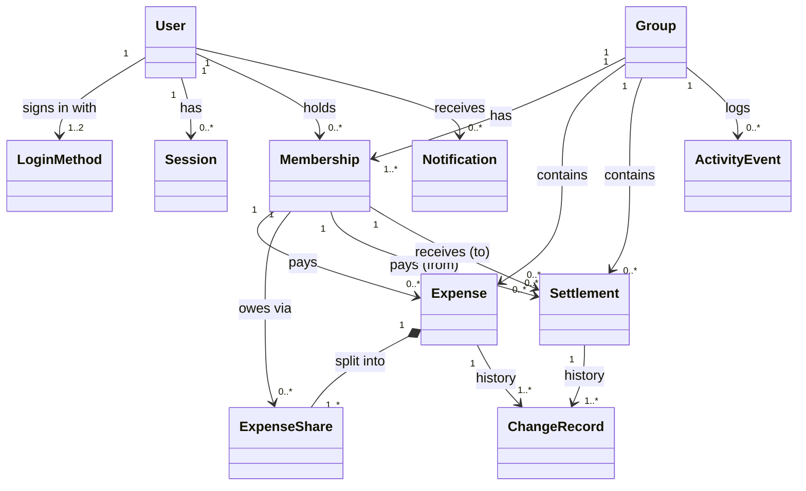

# SplitBook — Domain Model (v1)

Status: v1.0 · Based on REQUIREMENTS.md v1.1 (frozen) · 2026-10-01

Conceptual model only. No technology, storage, or API decisions here. Entity "information" lists describe business meaning, not columns.

---

## 1. Entity Overview

| # | Entity | Kind | One-line purpose |
|---|---|---|---|
| 1 | User | Core | A registered person |
| 2 | Login Method | Supporting | A way a User signs in (password or Google) |
| 3 | Session | Supporting | A logged-in device |
| 4 | Group | Core | A set of people sharing expenses |
| 5 | Membership | Core | A User's participation in a Group, with role and status |
| 6 | Expense | Core | A payment made by one member on behalf of participants |
| 7 | Expense Share | Core | One participant's portion of an Expense |
| 8 | Settlement | Core | A recorded repayment between two members |
| 9 | Change Record | Supporting | Before/after history of an Expense or Settlement |
| 10 | Activity Event | Supporting | Group-level feed entry |
| 11 | Notification | Supporting | In-app message to one User |

**Derived concepts** (computed, never entered by users):

| Concept | Derived from |
|---|---|
| Pairwise Balance | Active Expense Shares + active Settlements in a Group |
| Member Net Position | Pairwise Balances of one member in one Group |
| Overall Position | Member Net Positions across all a User's Groups |
| Personal Report | User's paid amounts, owed shares, and settlements over a Period |

**Value concepts** (no identity, defined by their value):

| Concept | Rule |
|---|---|
| Money | INR, exactly 2 decimals, > 0 where entered |
| Split Method | Equal · Exact · Percentage |
| Period | Calendar week (Mon–Sun) or calendar month, in IST |
| Record Status | Active · Deleted (soft) |

---

## 2. Entities & Responsibilities

### 2.1 User
**Represents:** one real person with one account per email.

**Key information:** display name, email (unchangeable), verified flag, account status.

**Responsibilities**
- Owns identity: one email → one User (FR-AUTH-04).
- Is searchable by name only when verified (FR-GRP-04, E22).
- Guards own deletion: allowed only when every Membership balance is zero (FR-AUTH-08).

**Invariants**
- Email unique across all Users.
- Unverified User cannot be added to any Group.

---

### 2.2 Login Method
**Represents:** a credential linked to a User — *Password* or *Google*.

**Responsibilities**
- Authenticates the User.
- Allows a User to have both methods on the same email (merge rule).
- Password method supports password change (FR-AUTH-06).

**Invariants**
- At most one Login Method of each type per User.
- A Google method marks the email verified; a Password method needs email verification.
- **Linking rule (security):** a Password method is attached to an existing account only after the email is verified. Otherwise someone could register a password on another person's email before they arrive via Google.

---

### 2.3 Session
**Represents:** one logged-in device/browser.

**Responsibilities**
- Proves the User is logged in on that device.
- Ends on logout (current device only, FR-AUTH-05).

---

### 2.4 Group
**Represents:** a named circle of people sharing costs.

**Key information:** name, description, created date, status (active / deleted).

**Responsibilities**
- Container and access boundary for its Expenses, Settlements, Activity, and Balances (FR-GRP-14/15).
- Enforces creation rule: ≥2 members at creation (FR-GRP-02).
- Always has exactly one Admin while active.
- On deletion, everything in it is removed for all members (FR-GRP-13, FR-GRP-18).

**Invariants**
- Exactly one active Membership with role Admin.
- Name required; names need not be unique.

---

### 2.5 Membership
**Represents:** a User's stint in a Group. Re-joining creates a **new** Membership (FR-GRP-12).

**Key information:** user, group, role (Admin / Member), status (Active / Left / Removed), joined date, ended date.

**Responsibilities**
- Decides permissions inside the Group (who may add, edit, remove, delete).
- Is the party that pays, participates, and settles — Expenses and Settlements reference Memberships, not raw Users. This keeps "Ravi (left)" on old records (FR-GRP-11) and separates a re-joined Ravi from the old one.
- Guards leave/remove: allowed only when this Membership's balance is zero (FR-GRP-09/10).
- Admin Membership drives the admin-leave flow (FR-GRP-16..19). Admin cannot remove self (FR-GRP-20).

**Invariants**
- At most one Active Membership per User per Group (E19).
- Only Active Memberships can pay, participate, or settle in new records.

---

### 2.6 Expense
**Represents:** one payment by one member, split among participants.

**Key information:** description (≤100), notes (≤500, optional), amount, expense date (not future), payer, split method, creator, status (active / deleted).

**Responsibilities**
- Owns its Expense Shares and keeps them consistent with amount and split method.
- Applies the split rules and remainder rule (section 4).
- Controls who can change it: creator or Group Admin (FR-EXP-06).
- Forbids changing split method (FR-EXP-07).
- Raises a settlement warning on edit when relevant (FR-EXP-09).
- Soft-deletes: stops counting in balances/reports but stays in history (FR-EXP-10).
- Becomes frozen (no edit/delete) once its payer or any participant is no longer active (FR-EXP-16).
- Emits a Change Record, an Activity Event, and Notifications on every create/edit/delete.

**Invariants**
- Amount > 0, 2 decimals.
- Payer is an Active Membership of the same Group at time of save.
- Sum of Shares = amount, exactly.
- At least one participant.

---

### 2.7 Expense Share
**Represents:** what one participant consumed from an Expense.

**Key information:** participant (Membership), entered value (exact rupees or percentage; none for equal), final owed amount.

**Responsibilities**
- Holds the final, rounded amount this participant owes the payer for this Expense.
- Keeps the user's original input (₹ or %) so edits and history show what was entered.

**Invariants**
- Final amount > 0 (₹0 / 0% means not a participant, FR-SPL-04).
- One Share per participant per Expense.
- Lives and dies with its Expense.

---

### 2.8 Settlement
**Represents:** a payment made outside the app from one member to another, recorded for the books.

**Key information:** from (payer), to (receiver), amount, date, note (free text), recorded by, status (active / deleted).

**Responsibilities**
- Reduces (or reverses) the pairwise balance between its two members.
- Allows partial and over-payment; over-payment raises a warning (FR-STL-02/03).
- Either party can record, edit, or delete it (FR-STL-01/05), unless either party is no longer active (FR-STL-09).
- Notifies the other party (FR-STL-04).
- Emits Change Record and Activity Event.

**Invariants**
- From ≠ To; both Active Memberships of the same Group at time of save.
- Amount > 0.
- Not linked to specific Expenses (pair-level only).

---

### 2.9 Change Record
**Represents:** one historical change to an Expense or Settlement.

**Key information:** subject (which Expense/Settlement), action (created / edited / deleted), actor, timestamp, before values, after values.

**Responsibilities**
- Gives full transparency of who changed what (FR-EXP-11).
- Captures concurrent edits: last write wins, but both writes are recorded (FR-EXP-12).

**Invariants**
- Append-only; never edited or removed (except when the whole Group is deleted).

---

### 2.10 Activity Event
**Represents:** one line in a Group's activity feed.

**Covers:** member added / removed / left, admin changed, group edited, expense added / edited / deleted, settlement added / edited / deleted (FR-ACT-01).

**Responsibilities**
- Tells the Group's story in time order; visible to all members.

**Invariants**
- Append-only; belongs to exactly one Group.

---

### 2.11 Notification
**Represents:** an in-app message to one User about something affecting them.

**Key information:** recipient, trigger type, link target (group / expense / settlement), read flag, time.

**Responsibilities**
- Informs affected Users only (FR-NTF-01).
- Tracks read / unread; supports mark-all-read (FR-NTF-02).
- Links to the related item (FR-NTF-03). History survives group deletion; link disabled (FR-NTF-05).

**Triggers → recipients**

| Trigger | Recipients |
|---|---|
| Added to group | Added user |
| Removed from group | Removed user |
| Admin transferred | New admin + all members |
| Group deleted via admin leave | All members |
| Expense added / edited / deleted | Payer + participants, except actor |
| Settlement added / edited / deleted | Other party |

---

## 3. Relationships

| From | To | Cardinality | Meaning |
|---|---|---|---|
| User | Login Method | 1 → 1..2 | Password and/or Google |
| User | Session | 1 → 0..* | Logged-in devices |
| User | Membership | 1 → 0..* | One per group stint |
| Group | Membership | 1 → 1..* | Exactly 1 active Admin |
| Group | Expense | 1 → 0..* | |
| Group | Settlement | 1 → 0..* | |
| Group | Activity Event | 1 → 0..* | |
| Membership (payer) | Expense | 1 → 0..* | Single payer per Expense |
| Expense | Expense Share | 1 → 1..* | Composition: shares die with expense |
| Membership (participant) | Expense Share | 1 → 0..* | |
| Membership | Settlement | 1 → 0..* as *from*, 0..* as *to* | |
| Expense / Settlement | Change Record | 1 → 1..* | First record is "created" |
| User | Notification | 1 → 0..* | |
| User (actor) | Expense / Settlement / Change Record | creator / recorder / actor | Who did it |

**Ownership / lifecycle**
- Deleting a **Group** removes its Memberships, Expenses, Shares, Settlements, Change Records, and Activity Events. Notifications stay (link disabled).
- Deleting an **Expense** (soft) keeps Shares and history; Shares stop counting.
- Deleting a **User** is blocked while balances exist; past Memberships stay as "left" so old records still read correctly.

---

## 4. Domain Rules (calculations)

### 4.1 Split calculation
1. Build raw shares by method:
   - Equal: amount ÷ participants.
   - Exact: entered rupees. Sum ≠ amount → reject (FR-SPL-02). No remainder possible.
   - Percentage: amount × %. Total ≠ 100 → reject.
2. Round each share to 2 decimals.
3. Remainder (amount − sum of rounded shares) → **payer's share** if the payer is a participant, else **first participant** (FR-SPL-01).
4. Drop any participant at ₹0 / 0%.
5. Check: sum of shares = amount.

3a. Remainder applies only to Equal and Percentage splits.

### 4.2 Balance derivation
For each Group, for every pair (A, B):
- `A owes B` += each active Share of A on an active Expense paid by B
- `B owes A` += each active Share of B on an active Expense paid by A
- `A owes B` −= active Settlements A → B
- `B owes A` −= active Settlements B → A
- **Net:** show one direction only — the difference (FR-BAL-01). No multi-party simplification.

Member Net Position = Σ (owed to me) − Σ (I owe) within a Group. Overall Position = Σ across Groups.

### 4.3 Zero-balance guard
Used by: member leave, admin remove member, admin leave via transfer, account deletion. All require Net Position = 0 in the relevant Group(s).

### 4.4 Personal Report
For a User and a Period (Mon–Sun week or calendar month, IST, by expense/settlement date), all groups or one group:
- **Paid:** Σ amounts of active Expenses where User is payer.
- **My share:** Σ User's active Expense Shares (includes self-only expenses, FR-SPL-05).
- **Settlements:** listed separately (paid out / received).
- CSV: one row per expense or settlement (FR-RPT-06).

---

## 5. User Workflows

Notation: **Actor** → steps → outcome. *Guards* are checks that can block.

### W1. Register with email + password
1. Visitor enters name, email, password.
2. System sends verification.
3. Visitor verifies → User becomes verified, searchable.
- *Guard:* email already linked to Google account → password linked only after verification (merge).

### W2. Sign in with Google
1. Visitor chooses Google.
2. Email new → User created, verified. Email exists → logs into existing User, Google method linked.

### W3. Log in / Log out
- Log in via either method → new Session.
- Log out → current Session ends only.

### W4. Manage profile
- Edit display name. Change password (password users). Email shown read-only.

### W5. Delete account
1. User requests deletion.
2. *Guard:* any non-zero balance in any Group → blocked, list of balances shown.
3. Otherwise account closed; past Memberships shown as "(left)".

### W6. Create group
1. User enters name, optional description.
2. Searches verified users by name, selects ≥1.
3. *Guard:* fewer than 2 total members → blocked.
4. Group created; creator = Admin; added users notified; Activity Events logged.

### W7. Add member (Admin)
1. Admin searches by name (verified users only).
2. *Guard:* already active member → blocked.
3. New Membership created; user notified; Activity Event.

### W8. Edit group details (any member)
- Change name/description → Activity Event.

### W9. Member leaves group
1. Member chooses Leave.
2. *Guard:* net position ≠ 0 → blocked with amount owed/owing.
3. Membership → Left; Activity Event.

### W10. Admin removes member
1. Admin chooses Remove on a member.
2. *Guards:* target is the admin themself → blocked (use W11); member's net position ≠ 0 → blocked.
3. Membership → Removed; removed user notified; Activity Event.

### W11. Admin leaves group
1. Admin chooses Leave → warning dialog with two options:
   - **(a) Transfer & leave:** pick an active member as new Admin. *Guard:* admin's net position ≠ 0 → blocked. New Admin set; old admin Membership → Left; all members notified.
   - **(b) Leave & delete group:** warning lists non-zero balances and states all data is deleted for everyone. Confirm → Group deleted; all members notified.

### W12. Delete group (Admin, without leaving)
1. Admin chooses Delete.
2. Non-zero balances → warning; confirm.
3. Group and all contents deleted; members notified.

### W13. Add expense
1. Member enters description, amount, date, payer, participants, split method, notes.
2. Split entry:
   - Equal → auto.
   - Exact → enter ₹ per person; live "₹X left".
   - Percentage → enter % per person; live "Y% left".
3. *Guards:* amount ≤ 0; future date; payer not active member; exact sum ≠ total; % ≠ 100; no participants.
4. Shares calculated (§4.1); Expense saved; Change Record; Activity Event; payer + participants notified.

### W14. Edit expense
1. *Guards:* actor is not creator and not Admin → blocked; payer or any participant no longer active → blocked.
2. Change fields; split method locked; may remove participants (exact/% → re-enter remaining shares).
3. If settlements exist between payer and any participant since creation → warning; confirm.
4. Save (last write wins); Change Record with before/after; Activity Event; affected users notified.

### W15. Delete expense
1. *Guards:* creator or Admin only; payer or any participant no longer active → blocked.
2. Confirm → Expense status Deleted; balances update; Change Record; Activity Event; notifications.

### W16. View expense list & detail
- Paginated list; search by description/notes text, date, amount.
- Detail shows all fields, shares, and full change history.

### W17. View balances
- Group view: pairwise netted lines, my "you owe" / "owes you", net.
- Dashboard: total owe, total owed, groups with net each, recent activity.
- Drill-down: expenses and settlements behind a pair balance.

### W18. Record settlement (settle up)
1. Either party opens "Settle up" with the other member; full outstanding amount prefilled.
2. Adjusts amount (partial allowed), date, note.
3. *Guards:* amount ≤ 0; same person; non-active member.
4. Amount > owed → warning; confirm.
5. Saved; balances update; Change Record; Activity Event; other party notified.

### W19. Edit / delete settlement
1. *Guards:* only the two parties; either party no longer active → blocked.
2. Edit or soft-delete; Change Record; Activity Event; other party notified.

### W20. Notifications
- Bell shows unread count; open list; click → go to item and mark read; mark all read.
- Notifications for a deleted group remain in history; link disabled ("Group deleted").

### W21. Reports & CSV
1. User opens Reports → current week by default, all groups.
2. Switch week/month; go to previous periods; filter by group.
3. See Paid, My share, Settlements.
4. Download CSV for current view.

---

## 6. Domain Findings — Resolved

All findings resolved and folded into REQUIREMENTS.md v1.1.

| # | Finding | Decision | Requirement |
|---|---|---|---|
| DF-1 | Editing/deleting records involving a departed member | Blocked | FR-EXP-16, FR-STL-09 |
| DF-2 | Exact split shortfall with no payer share | Exact split must equal total; else blocked | FR-SPL-02 |
| DF-3 | Password linking onto Google account | Only after email verification | FR-AUTH-04 |
| DF-4 | Admin removing self | Blocked; admin-leave flow only | FR-GRP-20 |
| DF-5 | Single-member group | Fully usable ("Trip Goa → only Karan remains") | FR-GRP-21 |
| DF-6 | Notifications after group deletion | History kept, link disabled | FR-NTF-05 |
